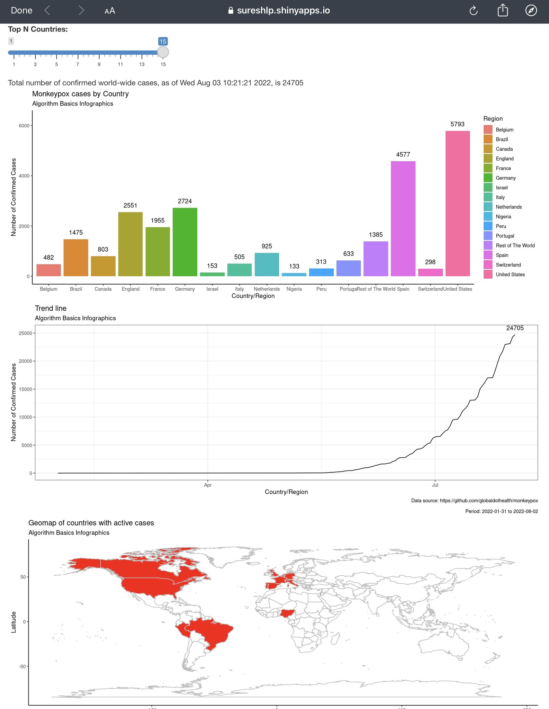

# Monkeypox MPX 2022

## Dataset discontinued September 2022

Human monkeypox (MPX) is a zoonotic viral disease caused by the Monkeypox virus (MPXV). This app tracks daily world-wide confirmed MPX cases using R Shiny.

## Details

The web app shows three data points.
- Daily world-wide confirmed MPX cases with a timestamp
- Top (up to) 15 countries and the cumulative rest of the world case statistics - frequency plot. 
- Trendline of active confirmed cases world-wide.
- Spread vector: spatial map of the top (up to) 15 countries with MPX confirmed cases.

***

# Links
- App live at [shinyapps.io](https://sureshlp.shinyapps.io/Monkeypox-Sep2022/)
- Data source: [https://github.com/globaldothealth/monkeypox](https://github.com/globaldothealth/monkeypox)
- [R code](https://raw.githubusercontent.com/sureshlazaruspaul/monkeypox-cases/main/monkeypox2022_v1.0.2.R)
